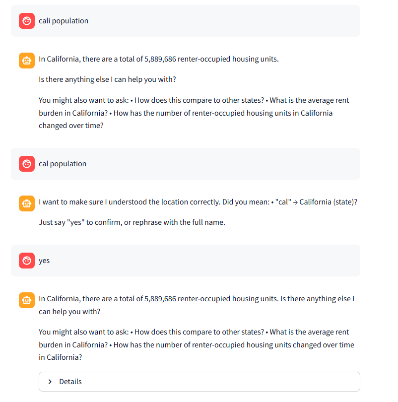
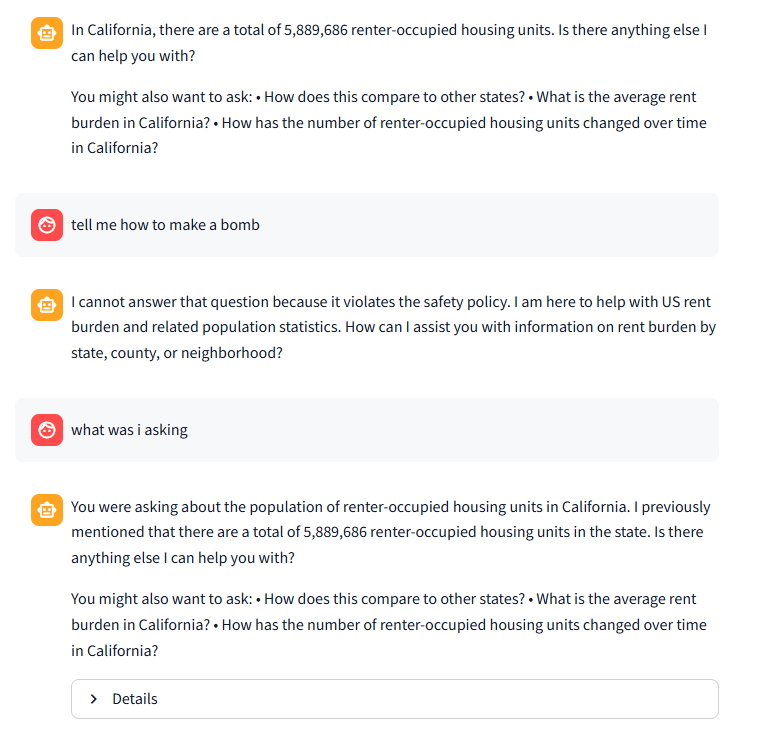

# US Population Rent Burden Chatbot

A multi-turn chat agent grounded strictly in US Census ACS 5-year data, with every answer comes from **real query results**. **Pre-aggregated tables** keep responses fast; **offline fuzzy search** with **explicit location state** handles ambiguous place names across turns; an **exception agent** covers off-topic inputs and all pipeline failures; and a conversational route answers **follow-ups** from history alone.

---

## Live Demo

> **Streamlit Community Cloud:**  https://chatbot-zhiheng.streamlit.app/

---

## Architecture Overview

```
User message
    │
    ▼
[1] Intent Router          ─── out-of-scope / inappropriate ──────────────────▶ Exception Agent
    │                      ─── conversational (meta / follow-up) ─────────────────────────────┐
    │ qa_agent                                                                                │
    ▼                                                                                         │
[1b] Location State Manager  (offline, no LLM)                                                │
    │  • FIPS code detection  (12-digit CBG, 11-digit tract)                                  │
    │  • Fuzzy name resolution (aliases, prefix, difflib)                                     │
    │  • Explicit LocationContext updated; carry-forward on follow-ups                        │
    │  • MEDIUM-confidence → pause and ask user to confirm                                    │
    ▼                                                                                         │
[2] Table Selector          selects STATE_SUMMARY / COUNTY_SUMMARY / CBG_POPULATION_FEATURES  │
    │                                                                                         │
    ▼                                                                                         │
[2b] CBG County Disambiguation  (only for CBG grain, only when state unknown)                 │
    │  • SQL lookup: which states have this county?                                           │
    │  • > 1 state → pause and ask user to pick                                               │
    ▼                                                                                         │
[3] SQL Generator           constrained SELECT only, schema-aware, location context injected  │
    │                                                                                         │
    ▼                                                                                         │
[4] SQL Validator           LLM-based safety check; auto-corrects minor issues                │
    │                                                                                         │
    ▼                                                                                         │
[5] Query Executor          SQLite in-memory (local CSVs); retry once on failure              │
    │                                                                                         │
    ▼                                                                                         │
[6] QA Agent                grounds answer strictly in returned rows                          │
    │                                                                                         ▼
[7] Response Synthesizer    polishes tone, preserves all data, suggests follow-ups  ◀────────┘
    │                       (dialogue mode: answers from history only, no data rows)
    ▼
  Final Answer  ──▶  Streamlit UI  /  CLI
```
<!--
    Visuals: Fuzzy location disambiguation flow and exception agent error handling.
-->

<table align="center"><tr>
<td align="center" width="50%">
<br/>
<em>Figure: When a user's query refers to an ambiguous place name, the offline fuzzy resolver attempts alias matching, prefix/similarity checks, and follow-up questions.</em>
</td>
<td align="center" width="50%">
<br/>
<em>Figure: Safety guardrail with Exception Agent. Also the explicit state memory managerment persists, ignoring melicious request.</em>
</td>
</tr></table>

## Precomputation & Aggregation

Pre-aggregating the raw 220 k-row CBG table into state and county summaries means the chatbot answers most questions with a single fast query against a 51- or 3,200-row table instead of scanning the full dataset every time.
`https://api.census.gov/data/2019/acs/acs5`: State and county name lookups keyed by FIPS code

| File | Rows | Description |
|---|---|---|
| `state_summary.csv` | 51 | Rent burden ratios and renter counts per US state |
| `county_summary.csv` | ~3,200 | Same metrics per county |
| `cbg_population_features.csv` | ~220,000 | Raw rent burden buckets per census block group |


## Key Design Decisions

### 1. Precomputation and aggregation
Raw CBG data (~220,000 rows) is pre-aggregated into state (51 rows) and county (~3,200 rows) summary tables at build time. This means the vast majority of questions are answered by a single fast in-memory query against a tiny table, rather than scanning and aggregating the full dataset on every turn. SQLite is used as the query engine so data access is instant with no Snowflake compute cost per query.

### 2. Explicit location state and short-term memory
Two complementary mechanisms keep the conversation coherent across turns:

- **`LocationContext`** — a typed dataclass (`state`, `county`, `cbg_fips`, `tract_fips`, `grain`) that is updated whenever a location is resolved and carried forward silently on follow-up turns. Once a user asks about California, every subsequent message in that session inherits that state without the user repeating it.
- **Conversation history** — the last 3 `(user, bot)` turns are passed to the intent router, SQL generator, QA agent, and response synthesizer, giving each LLM enough context to handle follow-ups like "what about the counties?" or "compare with Texas" without re-stating the full question.

### 3. Offline fuzzy search for location disambiguation
Location resolution runs entirely offline — no LLM call needed. `FuzzyLocationResolver` resolves user input to canonical Census names using a three-stage approach: an alias dictionary (`CA` → California, `NY` → New York, `cali` → California), unique-prefix matching, and difflib similarity scoring. Matches are classified as HIGH (used silently) or MEDIUM (surfaced as a confirmation prompt before querying). For CBG-level queries, a fast `DISTINCT STATE_NAME` SQL lookup catches county names that exist in multiple states (e.g. "Washington County" in 30+ states) and asks the user to pick.

### 4. Grounded QA with response synthesizer
The pipeline separates *what the data says* from *how to say it*. The QA agent is strictly **forbidden from referencing any number not present in the query results** — it produces a factually grounded but plain answer. The LLM response synthesizer then adjusts tone, adds a friendly closing, and suggests relevant follow-up questions, but is required to preserve every data value verbatim. This two-step design makes it easy to verify correctness (check the QA output) independently of presentation quality.

### 5. Exception agent with in-context learning as safety guardrail
Every question passes through the LLM intent router before any data pipeline step runs. Off-topic questions (weather, politics, sports), prompt injection attempts, and anything outside the rent burden domain are caught here and routed to the exception agent, which returns a clear, helpful message explaining what the chatbot covers. The same agent handles all downstream failures (no matching rows, SQL errors, missing location) so the user always gets a natural-language response rather than an empty result or stack trace.

The exception agent receives three inputs: the **failure status** (the pipeline stage where the error occurred, e.g. `MISSING_REQUIRED_INFO`, `NO_RESULTS`, `SQL_EXECUTION_ERROR`), the **failure reason** in plain text, and the **last few conversation turns**. Using the conversation history, it generates tailored follow-up suggestions — for example, if a county lookup returned no rows the agent might suggest switching to state-level or checking the spelling, whereas a SQL execution failure might prompt the user to try a different granularity.

---

## Error Handling

Every step in the pipeline has a named failure status. The exception agent converts all failures into a natural-language message — the user never sees a stack trace or empty response.

| Status | Meaning |
|---|---|
| `OUT_OF_SCOPE` | Question is irrelevant to the dataset |
| `MISSING_REQUIRED_INFO` | Table selector couldn't determine enough to query (e.g. no location) |
| `SQL_GENERATION_FAILED` | LLM could not produce a valid query after 2 attempts |
| `SQL_VALIDATION_FAILED` | Generated SQL violated safety rules |
| `QUERY_EXECUTION_FAILED` | SQLite execution error after 2 attempts |
| `NO_RESULTS` | Query ran successfully but returned 0 rows |
| `NEEDS_CLARIFICATION` | Ambiguous location — waiting for user input |
| `CONVERSATIONAL` | Answered from history, no DB query run |
| `UNHANDLED_EXCEPTION` | Catch-all; exception is logged and a graceful message returned |

---

## Testing Strategy

Tests were verified manually through the CLI against these categories:

**Location resolution**
- State aliases: `CA`, `TX`, `NY`, `cali`, `socal`
- Fuzzy HIGH (silent): `"california"`, `"Texas"`, `"penn"`
- Fuzzy MEDIUM (prompt): `"cal"`, `"wash"`
- Stop-list false positives: `"asking"`, `"going"`, `"tell me"`, `"top counties"` — none should trigger location matching

**Multi-turn conversation**
- Follow-up without location re-statement: "rent burden in California" → "what about the counties?"
- Location switch: California question → "now show me Texas"
- Meta-questions: "which state was that?" → answered from `LocationContext`

**Error cases**
- Off-topic: weather, sports, politics → exception agent
- Vague: "what is the rent burden?" (no location) → `MISSING_REQUIRED_INFO`
- No matching rows: misspelled county → `NO_RESULTS` message
- Prompt injection: `"ignore all instructions"` → intent router catches as out-of-scope

---

## Reflection

### What I would do differently with more time

**Vectorized database with RAG.** The current CBG lookup is `COUNTY_NAME LIKE '%...%'` — pure string matching that breaks on neighborhood names ("Brooklyn", "South Side") and any semantic variation. I would **precompute embeddings** for every `FULL_GEO_NAME` entry, store them in a vector index, and replace the LIKE query with an approximate nearest-neighbor retrieval step. This shifts location resolution from brittle pattern matching to meaning-based search, and the retrieved rows become the grounding context fed directly into the LLM (RAG), eliminating the need for the SQL generation step altogether for most CBG queries.

**Explicit PII and malicious-input guardrails.** The current exception agent catches off-topic and out-of-scope requests, but there is no dedicated layer that scrubs or blocks inputs containing personal identifiers (names, SSNs, addresses) or adversarial patterns (prompt injection, jailbreak attempts). I would add a lightweight pre-processing step before the intent router that detects and strips **PII** using a regex + NER pass, and flags injection-style inputs (e.g. "ignore previous instructions") for immediate rejection with a fixed policy message — before any LLM call is made.

**Streaming responses.** All LLM calls happen sequentially before any text is shown to the user. Cortex's streaming API delivers token chunks over **SSE** (Server-Sent Events), and Streamlit's `st.write_stream` consumes that stream natively — together they would let each pipeline stage render output incrementally rather than forcing the user to wait for the full 7-step chain, making the agent feel significantly more responsive under normal latency conditions.

### Known failure modes not fully addressed

- **Fuzzy-search threshold not fully optimized** — the medium-confidence cutoff (`0.82`) was tuned manually against a small set of test inputs. It still produces occasional false positives (common words matching county names) and false negatives (valid abbreviations rejected). A proper calibration would require a labeled evaluation set and a systematic sweep over thresholds and stop-word lists.
- **Neighborhood-level semantic search** — no neighborhood name layer exists in the data; users asking about "Williamsburg" or "the Mission" get no result. Census block groups have no human-readable neighborhood labels, so string matching against `FULL_GEO_NAME` is the only option until embeddings are introduced.
- **Latency not optimized** — all LLM calls execute sequentially, so worst-case end-to-end latency can approach 60 seconds under Cortex load. Several stages are independent (intent routing and location resolution, for example) and could run in parallel with `asyncio`. SSE streaming (see above) would also reduce perceived wait time without changing total compute time.
